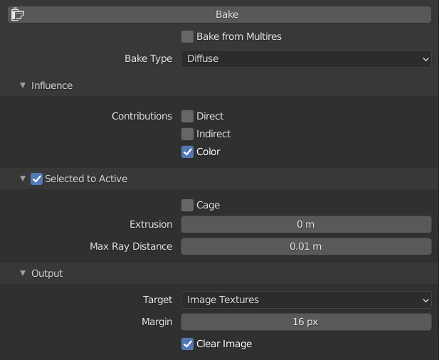
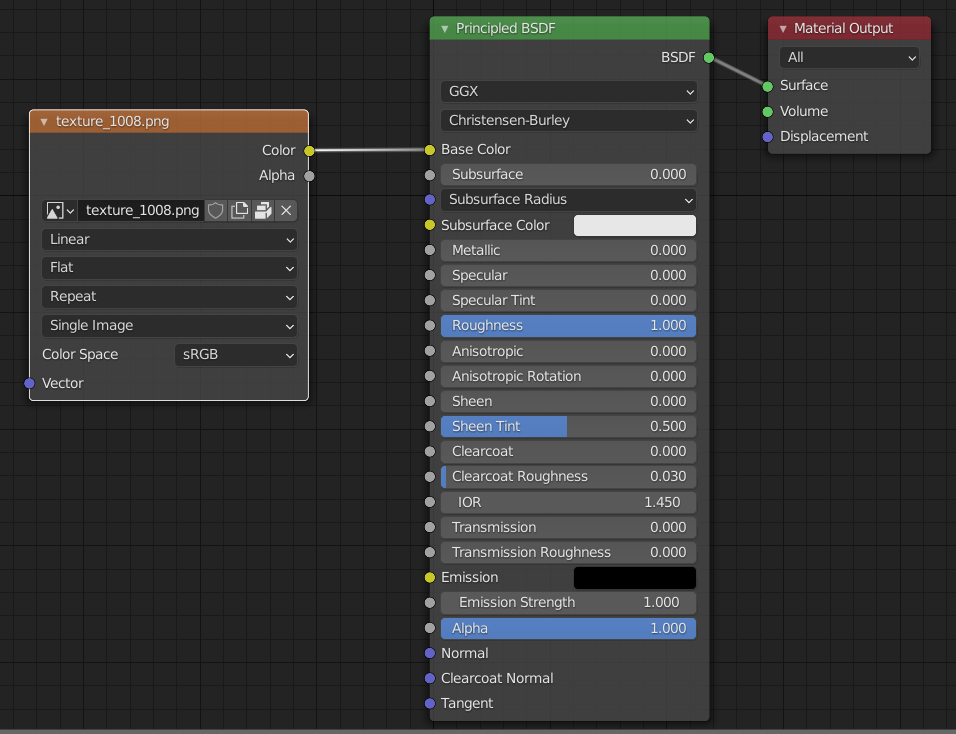
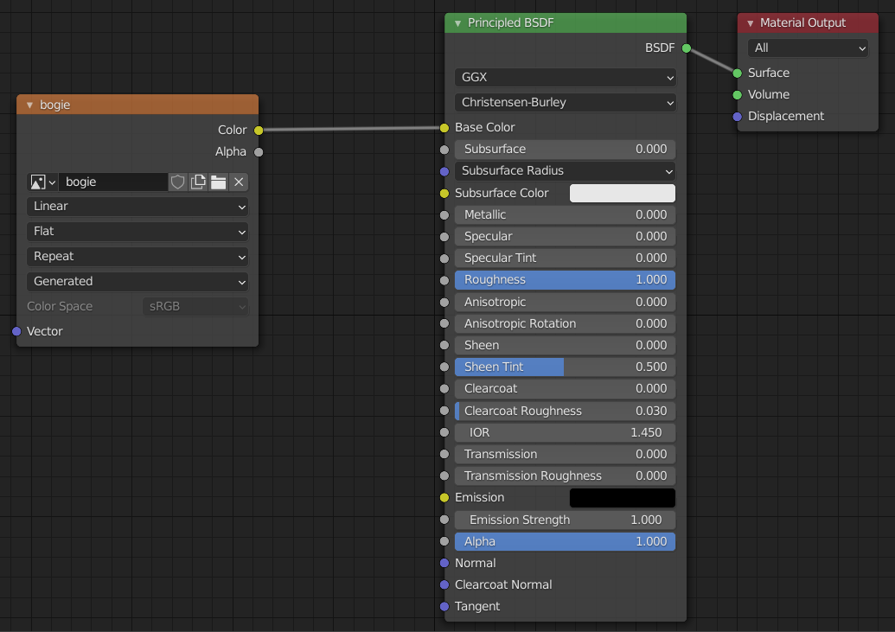

Diffuse bake with only color selected still results in different colors
=======================================================================

I thought doing a diffuse bake with only color selected (i.e. direct and indirect lighting contributions turned off) would result in the target object texture ending up with the same colors as the source object texture.

However, as you can see below, the target object (the lower one) ends up with much paler colors than the source.

There are no odd nodes involved - both objects just have an _Image Texture_ node, a _Principled BSDF_ node and a _Material Output_.

_Colors come out paler on lower target object._  

_Diffuse Bake with just Color selected._  

_Source object nodes._  

_Target object nodes._  

See [`bogie-ready-to-bake.blend`](bogie-ready-to-bake.blend) for the `.blend` file as it was just before I clicked _Bake_.

If it's relevant, the target object is a remeshed version of the target object with about 1/4 the faces of the original source object.

Note: the mottling (the black patches seen all over the target object) seems to be affected by the _Max Ray Distance_ value. The bigger the value the greater the mottling - however, 1cm seems to the give the best result I can achieve, going even lower doesn't seem to improve things further.
